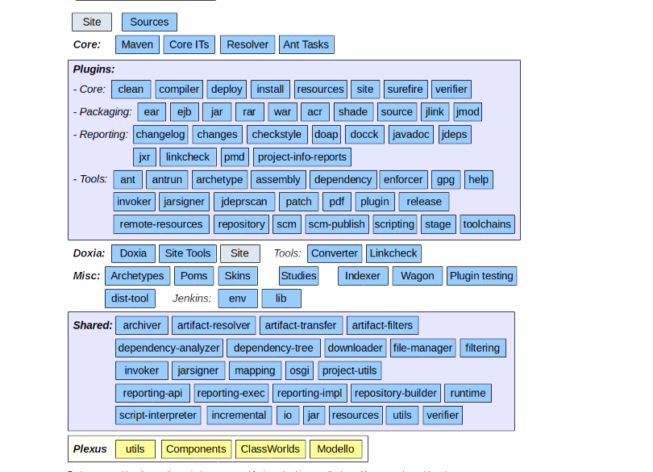
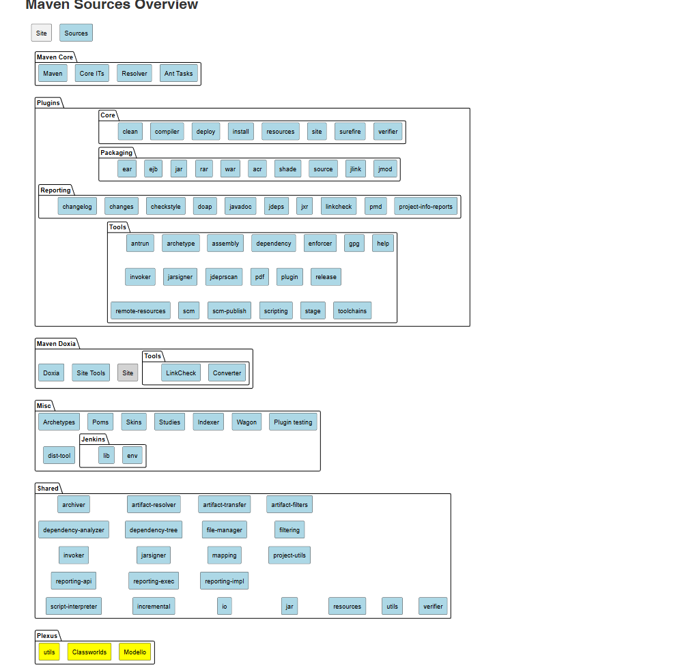
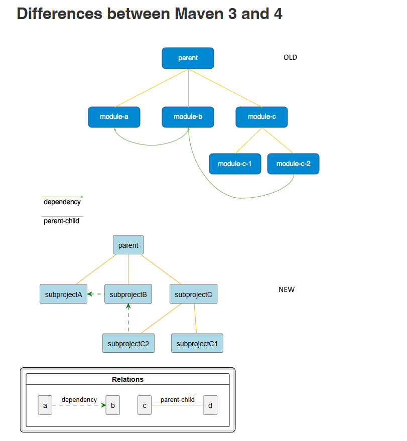
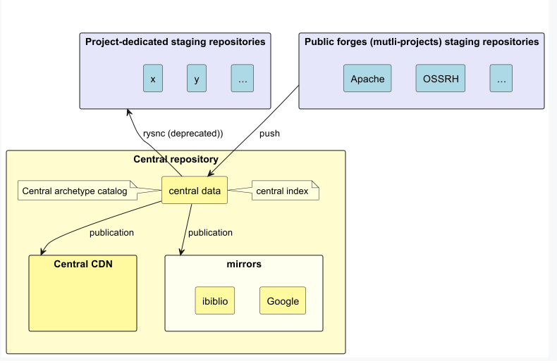

# Conversion to PlantUML

## General

* Styling changed to `Style` syntax (`skinparameters` are depreacted)

## Sources

* PUML-Diagrams of "Sources" page renamed with prefix
* URL added for **all** repositories

* Plugins
  * `docck` plugin not added (repository is archived)
  * `ant` plugin not added (repository is archived)
  * `patch` plugin not added (repository is archived)
  * `repository` plugin not added (repository is archived)

* Shared
  * `downloader` not added (repository is archived)
  * `osgi` not added (repository is archived)
  * `repository-builder` not added (repository is archived)
  * `runtime` not added (repository is archived)

* Plexus
  * `Componentns` prepared, but not added to visual (repository is archived)

## Guide: Multi subprojects

## Repository

### Maven Central Repository

